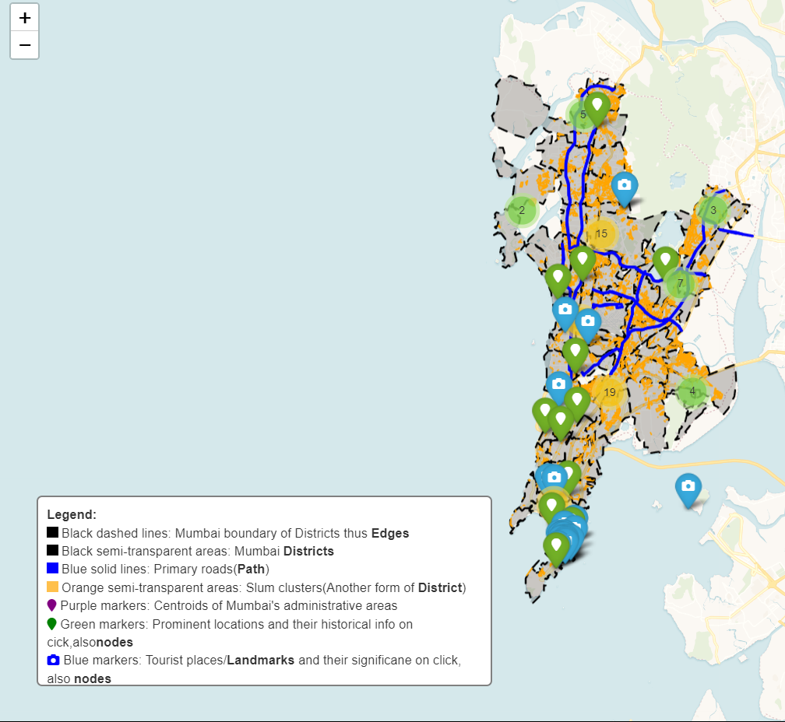
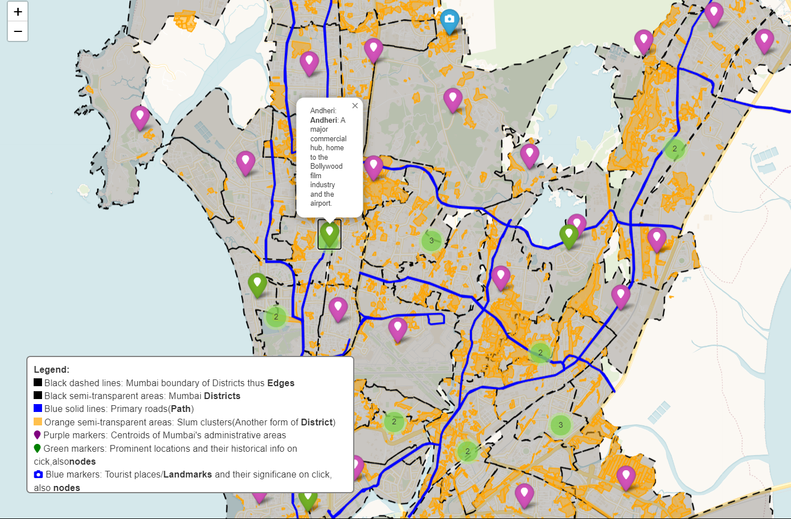

# Mumbai Data Exploration & Visualization

Welcome to the Mumbai Data Exploration & Visualization repository! This project leverages the powerful OSMnx library to extract and visualize a wide array of data, starting with the intricate network of roads in Mumbai. Designed to be flexible and adaptable, this tool can be customized to gather and plot different types of urban data, offering insights into the city's layout, infrastructure, and more.

Downlaod and open in a brower to interact with the Map: [Mumbai Map with Slums](mumbai_map_with_slums.html)




---

## Project Overview

### Data Extraction & Visualization (`play.py`)
At the heart of this project is the `play.py` script, a versatile tool for data scientists, urban planners, and curious explorers alike. While our current focus is on mapping Mumbai's roads, the script's true power lies in its adaptability. Users can extract a variety of data points - from green spaces and water bodies to urban landmarks and transportation networks - and visualize them on detailed maps. This feature makes it an invaluable resource for comprehensive urban analysis and planning.

---

## Getting Started

### Prerequisites
- Python 3.x
- OSMnx library
- Additional Python libraries as per requirements.txt

### Installation
Clone the repository and install dependencies to dive into Mumbai's urban landscape:

```bash
git clone https://github.com/MasterKinjalk/mumbai-data-viz.git
cd mumbai-data-viz
pip install -r requirements.txt
```

---

## Usage

To start extracting and visualizing data with the `mindmapmumbai.py` script:

```bash
python mindmapmumbai.py
```

Customize the script to target different data sets and visualize various aspects of Mumbai or any other urban environment.

---

## Integration of `play.py` with `mindmapmumbai.py`

### Overview
The script `play.py` is designed to extract various data from the OSMnx library, catering to different use cases specific to our project's needs. To effectively utilize this extracted data, modifications are necessary in the `mindmapmumbai.py` script. This ensures that the insights and information obtained from `play.py` are accurately represented and utilized in the project's core functionalities.

### Modifications in `mindmapmumbai.py`
After extracting the desired data using `play.py`, it is essential to incorporate this data into the `mindmapmumbai.py` script to reflect its usage and impact on the project. The integration process involves updating `mindmapmumbai.py` to:

1. **Import Data:** Ensure that `mindmapmumbai.py` has the appropriate functions or mechanisms to import or read the data extracted by `play.py`.
2. **Utilize Extracted Data:** Modify the logic within `mindmapmumbai.py` to use the data for its specific functionalities. This could involve updating data structures, algorithms, or processing methods to accommodate the new information.
3. **Reflect Changes in Output:** Ensure that any changes in data or logic are reflected in the outputs of `mindmapmumbai.py`, whether it be through visual representations, data analysis results, or any other form of output relevant to the project.

### Best Practices
- **Consistency:** Maintain a consistent data format between `play.py` and `mindmapmumbai.py` to minimize integration issues.
- **Modularity:** Keep the data extraction and processing logic as modular as possible. This simplifies updates or modifications to either script without significantly impacting the other.
- **Documentation:** Document any changes made to `mindmapmumbai.py` for integrating `play.py` data. This includes comments in the code and updates in the README or any other relevant documentation.

By following these guidelines and ensuring a seamless integration of data extracted with `play.py` into `mindmapmumbai.py`, the project can fully leverage the capabilities of the OSMnx library and enhance its functionality and effectiveness.

--- 

## Contributing

Contributions are welcome! Whether you're enhancing the data extraction capabilities, adding new visualization features, or improving the documentation, your input helps make this project more valuable to everyone.

---

## License

This project is licensed under the MIT License - see the [LICENSE.md](LICENSE.md) file for details.

---

## Acknowledgments

- A big thank you to all contributors and users for your support and feedback.
- Gratitude to the developers of OSMnx for providing the tools to make this project possible.
